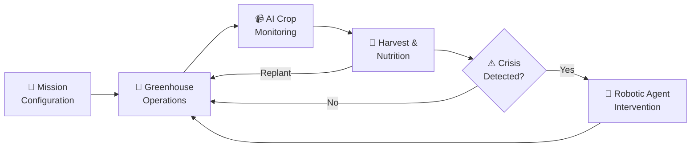
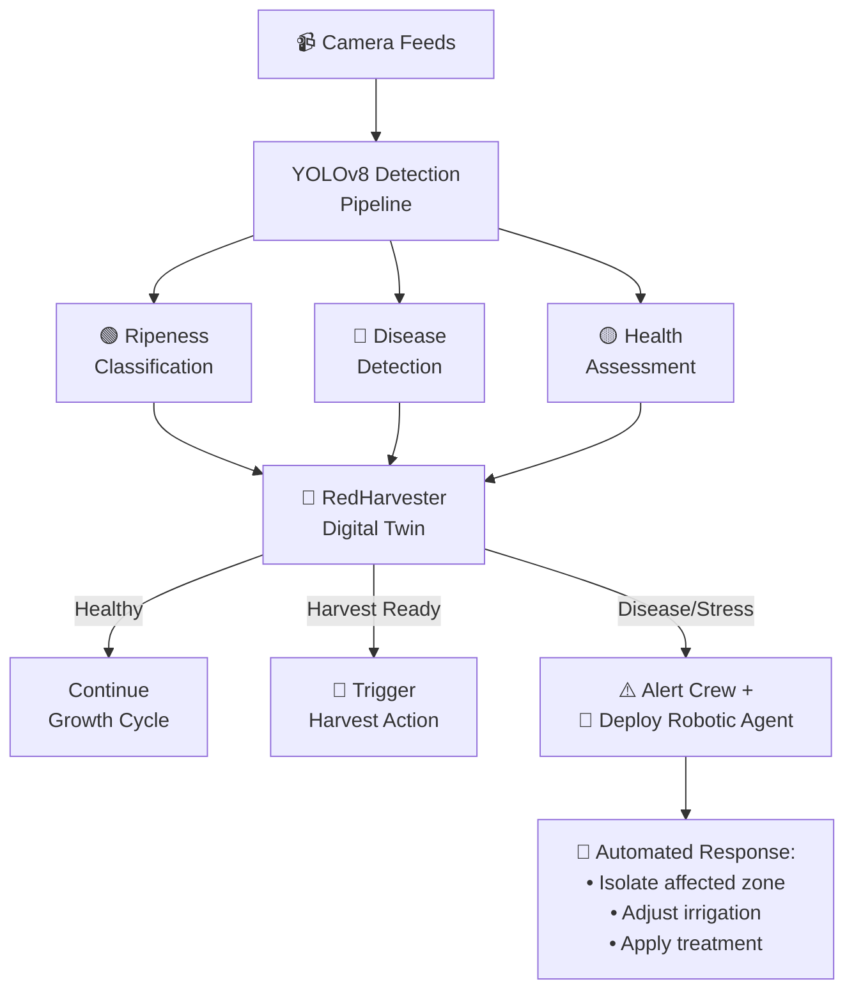
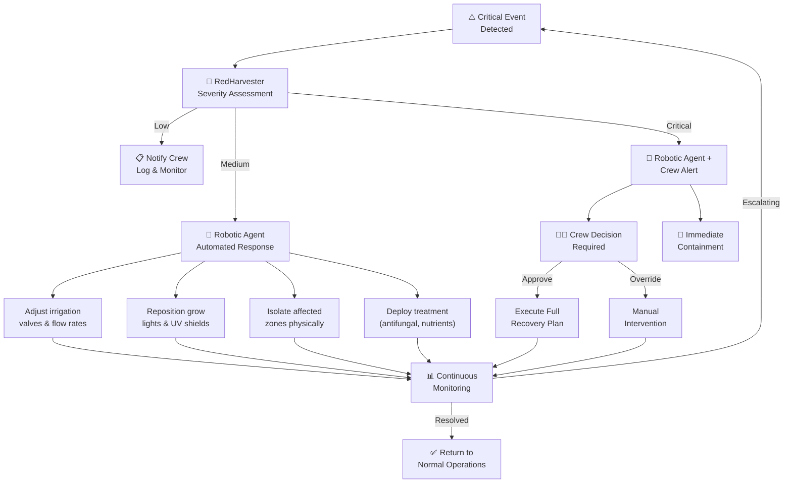
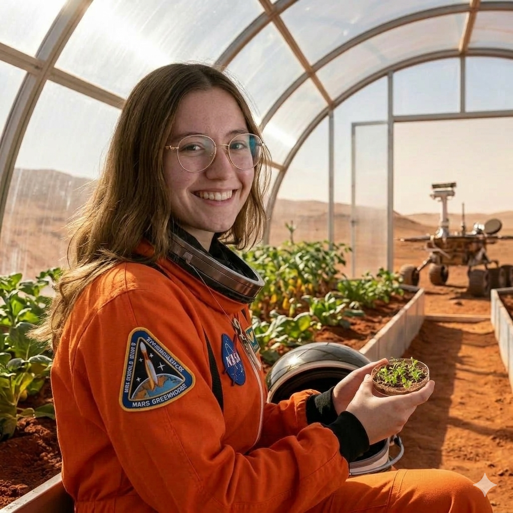
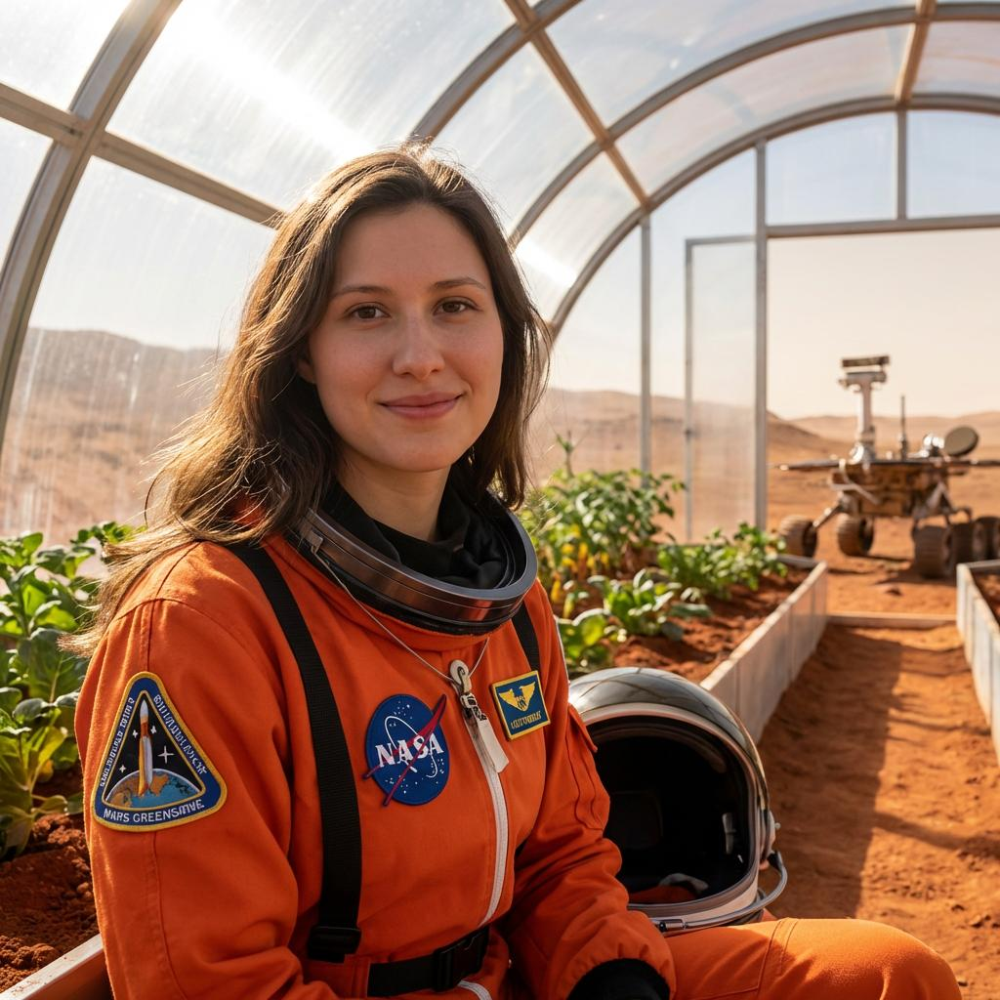
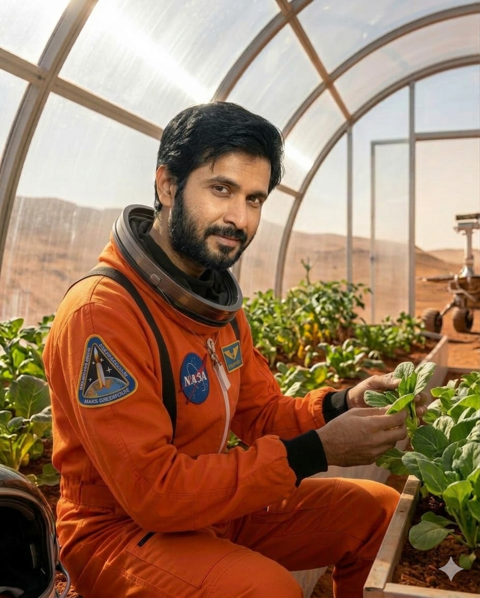
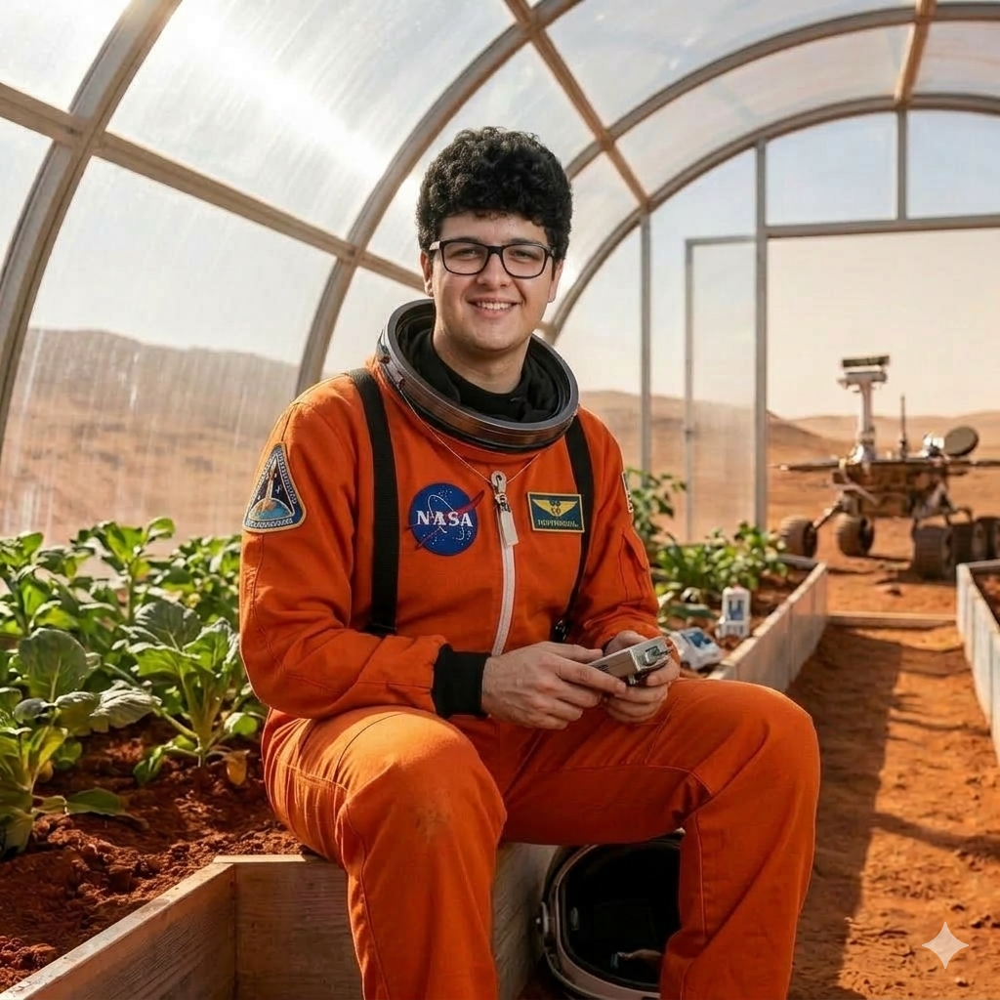

# 🚀 RedHarvester — Mars Greenhouse AI

> **AI-powered digital twin for autonomous greenhouse management on Mars**

<p align="center">
  
  
  
  
  
  
</p>

---

## 🌍 The Problem

NASA is targeting the late 2030s to send astronauts to Mars — a 9-month journey each way with a 450+ day surface stay. Pre-packed food supplies are finite, heavy, and expensive to launch. **Growing food on Mars is not optional — it's a survival requirement.** But Mars presents extreme challenges: -80°C nights, 0.38g gravity, intense UV radiation, dust storms that block sunlight for weeks, and no natural soil.

Astronauts need an **intelligent system** that can autonomously manage a greenhouse, adapt to Martian conditions, detect crop health issues in real time, and ensure the crew receives balanced nutrition throughout the entire mission.

## 🎯 What is RedHarvester?

RedHarvester is a **complete digital twin** of a Martian greenhouse — a mission planning and operations platform that takes astronauts from pre-launch configuration all the way through daily greenhouse management, harvest scheduling, and nutritional balancing.

The system combines **real-time environmental modeling**, **computer vision-based crop monitoring**, **dynamic nutritional calculations**, and an **AI agent backed by Syngenta's agricultural knowledge base** to provide autonomous decision-making and crew assistance in critical situations.

---

## 🧭 How It Works — The Mission Walkthrough

RedHarvester guides the crew through the entire mission lifecycle:



### Phase 1: Mission Configuration

Before launch, the crew defines every parameter of their mission:

**1. Crew Setup**
Each astronaut is registered with their physical profile — age, weight, height, sex, and activity level. The system computes individualized **Basal Metabolic Rate** using the Mifflin-St Jeor equation, adjusted for Mars gravity (0.38g) and EVA suit work. From this, RedHarvester calculates exact daily nutritional targets: calories, protein, vitamin C, fiber, iron, and calcium for the entire crew.

**2. Mission Parameters**
The crew configures the mission duration (default: 450 sols), available pre-packed food supply (measured in sols of runway), and total greenhouse area (m²). These constraints directly inform the crop optimization algorithm.

**3. Resource Allocation**  
Initial water reserves, energy storage capacity, nutrient supply, and solar panel output are configured. The system models water recycling rates, energy consumption curves, and nutrient depletion to ensure the greenhouse can sustain operations.

**4. Seed Selection & Planting Optimization**
From a library of **30+ scientifically validated crops**, the crew selects which seeds to bring. RedHarvester's **crop optimizer** then automatically calculates the optimal planting layout based on:
- Crew caloric and micronutrient requirements
- Available greenhouse area
- Crop growth cycles (ensuring staggered harvests for continuous food supply)
- Water and energy budgets
- Mars suitability scores

The optimizer prioritizes fast-growing crops when pre-packed food supplies are limited, while balancing long-term nutritional diversity.

### Phase 2: Greenhouse Operations

Once the mission launches, RedHarvester runs the greenhouse autonomously:

**Real-Time Crop Growth Tracking**
Every planting zone is monitored continuously. The system tracks growth progress, plant health, water stress levels, and predicted harvest dates. Each crop follows its real growth cycle — from seedling emergence through vegetative growth, flowering, fruiting, and harvest readiness.

**Automated Resource Management**
Water, energy, and nutrients are balanced dynamically:
- Water consumption per zone is calculated based on crop type, growth stage, and environmental conditions
- Solar energy production fluctuates with Mars seasons, dust opacity, and time of day
- The water recycling system recovers and redistributes used water
- Nutrient reservoirs are tracked and allocated proportionally

**Mars Weather Integration**
The environmental model uses real NASA/ESA atmospheric data to generate accurate Martian conditions:
- **Seasonal cycles** driven by solar longitude (Ls), modeling Northern Spring through Winter
- **Diurnal temperature swings** from -80°C at night to -10°C at midday
- **Dust storms** that reduce solar irradiance and trigger energy conservation protocols
- **UV radiation**, atmospheric pressure, wind speed and direction
- **Solar irradiance** calculations accounting for Mars-Sun distance and dust optical depth

### Phase 3: AI-Powered Crop Monitoring

The monitoring loop runs continuously, feeding data back into every decision:



**Computer Vision Detection**
RedHarvester integrates a YOLOv8-based detection pipeline for real-time crop analysis. The camera feeds provide continuous monitoring with automated detection of:
- **Ripeness classification** — identifying fruit maturity stages from seedling to harvest-ready
- **Disease detection** — flagging fungal lesions, leaf spot, and blight at early stages
- **Health assessment** — monitoring plant stress indicators and critical conditions
- **Infrastructure status** — verifying grow light operation and irrigation line flow

The tomato zone demonstrates this with real growth data processed through our detection pipeline, showing annotated bounding boxes with confidence scores tracking plant development over time.

https://github.com/user-attachments/assets/tomatoes_grow_annotated.mp4

### Phase 4: Harvest & Nutrition Management

**Dynamic Nutritional Balancing**
As crops are harvested, RedHarvester recalculates the crew's nutritional status in real time:
- Daily calorie, protein, and vitamin intake vs. crew requirements
- Pre-packed food supply runway countdown
- Production rate trends — is the greenhouse producing enough to sustain the crew?
- Automated replanting recommendations to maintain continuous food supply

**Harvest Scheduling**
The system tracks every harvest event, logs food stores by crop type and nutritional content, and monitors consumption patterns. When a crop zone reaches maturity, the crew receives a harvest action request with full context on timing and nutritional impact.

**Crew Action System**
Critical decisions require crew approval:
- Harvest confirmations with optimal timing analysis
- Replanting recommendations with crop selection rationale
- Emergency responses to resource shortages
- Auto-approve mode available for routine operations

### Phase 5: Crisis Response & Robotic Agent

Mars is unpredictable. When a critical event is detected — whether by the CV pipeline, environmental sensors, or resource monitors — RedHarvester activates a **multi-layered response** combining AI decision-making with autonomous robotic intervention:



**Robotic Agent Capabilities:**
The greenhouse robotic agent operates as the physical extension of RedHarvester, executing tasks that require immediate physical intervention without waiting for crew availability:
- **Irrigation control** — Dynamically adjusts water flow per zone, redirects supply from low-priority to critical crops during pump failures
- **Environmental control** — Repositions grow lights, activates emergency ventilation, deploys UV shielding during radiation spikes
- **Zone isolation** — Physically seals off diseased sections to prevent pathogen spread across the greenhouse
- **Treatment deployment** — Applies targeted antifungal treatments, adjusts nutrient concentrations, manages emergency fertilization
- **Harvest assistance** — When detection confirms ripeness, the robotic agent can initiate collection of mature crops to prevent over-ripening during crew absence (EVA operations)

**Scenario Response Matrix:**

| Scenario | Impact | Robotic Agent Response | Crew Role |
|----------|--------|----------------------|------------|
| 🌪️ **Dust Storm** | Solar output -70%, 8+ days | Switches to energy conservation mode, reduces irrigation to minimum, prioritizes calorie-dense crops | Monitor, approve resource reallocation |
| 💧 **Pump Failure** | Water delivery -50% | Redistributes water via backup valves, cuts non-essential zones, increases recycling pressure | Repair hardware |
| 🌡️ **Temperature Spike** | Thermal regulation failure | Activates emergency ventilation, repositions reflective shields, mists heat-sensitive crops | Inspect cooling systems |
| 🦠 **Fungal Outbreak** | Disease spreading | Isolates affected zone, deploys antifungal treatment, increases airflow, adjusts humidity | Confirm treatment plan |
| ⚡ **Power Outage** | Battery-only mode | Shuts down non-essential lighting, maintains minimum irrigation for top-priority zones | Restore power systems |

The AI agent provides real-time consultation throughout every crisis — explaining what's happening, why the robotic agent is taking specific actions, and what the crew should focus on, all backed by Syngenta's agricultural expertise.

---

## 🌱 Crop Library — 30+ Validated Crops

Every crop in the library includes full scientific data: growth cycle duration, water and energy requirements per m², optimal temperature and humidity ranges, CO₂ tolerance, yield per m², and a complete nutritional profile (calories, protein, vitamin C, fiber, iron, calcium per kg).

| Category | Crops | Mars Suitability | Why It Matters |
|----------|-------|------------------|----------------|
| 🥬 **Leafy Greens** | Lettuce, Spinach, Kale, Bok Choy, Swiss Chard | 9-10/10 | Fast growth (25-40 days), rich in micronutrients, low resource cost |
| 🥔 **Root & Tuber** | Potato, Sweet Potato, Radish, Carrot, Beet | 8-10/10 | Calorie-dense staples, long storage life, high CO₂ tolerance |
| 🫘 **Legumes** | Beans, Soybean, Peas, Lentils | 8-9/10 | Essential protein source, nitrogen fixation benefits |
| 🍅 **Fruits** | Tomato, Pepper, Cucumber, Strawberry | 7-8/10 | Vitamin C, dietary variety, crew morale |
| 🌾 **Grains** | Wheat, Amaranth, Buckwheat, Barley | 7-8/10 | Long-term caloric foundation, storable |
| 🌿 **Herbs** | Basil, Cilantro, Mint, Parsley | 8-9/10 | Compact, fast-growing, flavor and micronutrients |
| 🌱 **Microgreens** | Multi-species | 10/10 | 7-14 day cycle, 4-40× nutrient density of mature plants |

Crop diversity ensures **micronutrient completeness** (iron from spinach, calcium from kale, vitamin C from peppers), **staggered harvest cycles** for continuous food supply, and **dietary variety** to maintain crew health and morale over 450+ days.

---

## 🤖 AI Agent — Syngenta Knowledge Integration

The RedHarvester agent connects to **Syngenta's agricultural knowledge base** via AWS AgentCore, providing:

- **Crop viability analysis** — Given current Mars conditions (temperature, radiation, dust levels), which crops will thrive?
- **Growth recommendations** — Optimal planting density, irrigation schedules, light cycles
- **Disease diagnosis** — Identify crop diseases and recommend treatments
- **Nutrition planning** — Calculate optimal crop mixes for crew dietary requirements
- **Crisis consultation** — Real-time advice during dust storms, equipment failures, or disease outbreaks

The agent is accessible through a conversational chat interface, allowing astronauts to ask questions in natural language and receive expert agricultural guidance.

---

## 🏗️ Architecture

```
┌─────────────────────────────────────────────────────────┐
│  DIGITAL TWIN (React + TypeScript + Tailwind CSS)       │
│  ├─ Real-time Simulation Engine                         │
│  │   └─ Day ticks, resource balancing, weather model    │
│  ├─ Computer Vision Pipeline                            │
│  │   └─ YOLOv8 crop detection, ripeness classification  │
│  ├─ Dynamic Nutrition Calculator                        │
│  │   └─ BMR-adjusted crew targets, intake tracking      │
│  └─ 18 Interactive Components                           │
│      └─ Dashboard, greenhouse, camera, analytics...     │
├─────────────────────────────────────────────────────────┤
│  AI BACKEND (Python FastAPI)                            │
│  ├─ /chat      → Conversational AI agent                │
│  ├─ /query     → Knowledge base retrieval               │
│  ├─ /analyze   → Crop viability under Mars conditions   │
│  └─ /nutrition → Dynamic meal planning                  │
├─────────────────────────────────────────────────────────┤
│  KNOWLEDGE LAYER                                        │
│  ├─ Syngenta AWS AgentCore Gateway                      │
│  ├─ MCP Protocol (Model Context Protocol)               │
│  └─ Strands SDK for agent orchestration                 │
└─────────────────────────────────────────────────────────┘
```

---

## 🚀 Getting Started

### Prerequisites
- **Node.js** 18+
- **Python** 3.10+

### Frontend

```bash
cd mars-greenhouse
npm install
npm run dev
```

Open http://localhost:5173

### Backend

```bash
cd backend
pip install -r requirements.txt
python server.py
```

---

## 🛠️ Tech Stack

| Layer | Technology |
|-------|-----------|
| Digital Twin | React 19, TypeScript 5.9, Vite 8, Tailwind CSS 4 |
| Animation | Framer Motion |
| Charts & Analytics | Recharts |
| Backend | Python, FastAPI |
| AI Agent | Strands SDK, MCP Protocol, AWS AgentCore |
| Computer Vision | YOLOv8 crop detection pipeline |
| Knowledge Base | Syngenta agricultural data + NASA/ESA Mars environmental data |

---

## 👥 Team

| | Name | Role |
|---|------|------|
|  | **Sara Rutz** | Commander |
|  | **Katrina Jaroslavceva** | Flight Engineer |
|  | **Arka Mitra** | Science Officer |
|  | **Mohanad Kandil** | Systems Engineer |

---

*Built for **Syngenta START Hack 2026** — Agriculture's Next Frontier: Feeding Humans on the Red Planet.*
