# Red Harvester — Ideal Architecture
## Mars Autonomous Greenhouse: Multi-Agent System on AWS

---

## Architecture Diagram

```mermaid
flowchart TB
    classDef physical fill:#4a2810,stroke:#ff6b35,color:#fff,stroke-width:2px
    classDef edge fill:#1a3a1a,stroke:#4caf50,color:#fff,stroke-width:2px
    classDef iot fill:#1a237e,stroke:#42a5f5,color:#fff,stroke-width:2px
    classDef data fill:#0d47a1,stroke:#64b5f6,color:#fff,stroke-width:2px
    classDef agent fill:#b71c1c,stroke:#ef5350,color:#fff,stroke-width:3px
    classDef orchestrator fill:#ff6f00,stroke:#ffa726,color:#fff,stroke-width:3px
    classDef storage fill:#1b5e20,stroke:#66bb6a,color:#fff,stroke-width:2px
    classDef ui fill:#4a148c,stroke:#ab47bc,color:#fff,stroke-width:2px
    classDef compute fill:#e65100,stroke:#ff9800,color:#fff,stroke-width:2px

    %% ═══════════════════════════════════════
    %% PHYSICAL LAYER — Greenhouse Hardware
    %% ═══════════════════════════════════════
    subgraph GREENHOUSE["🏠 MARS GREENHOUSE — Physical Layer"]
        direction LR
        subgraph SENSORS["📡 Sensors"]
            S1["🌡️ Temp / Humidity\nDHT22"]
            S2["💧 Soil Moisture\nCapacitive"]
            S3["🌬️ CO₂ Sensor\nMH-Z19B"]
            S4["☀️ PAR Light\nSensor"]
            S5["⚗️ pH / EC\nSensor"]
            S6["📷 RGB + IR\nCameras"]
        end
        subgraph ACTUATORS["⚙️ Actuators"]
            A1["💧 Water Pump\n+ Solenoid Valves"]
            A2["🧪 Nutrient Dosing\nPeristaltic Pumps"]
            A3["💡 LED Grow Lights\nPWM Dimmable"]
            A4["🌀 Ventilation Fans\n+ CO₂ Injector"]
            A5["🤖 Robotic Arm\n6-DOF Precision"]
            A6["🌡️ Heating Element\n+ Peltier Cooler"]
        end
    end

    %% ═══════════════════════════════════════
    %% EDGE LAYER
    %% ═══════════════════════════════════════
    subgraph EDGE["🖥️ EDGE COMPUTE — AWS IoT Greengrass v2"]
        direction LR
        GG["AWS IoT Greengrass\nCore Device"]
        EDGE_ML["Local ML Inference\nSageMaker Neo Runtime"]
        EDGE_CACHE["Local State Cache\n+ Fail-safe Logic"]
        MQTT_LOCAL["Local MQTT Broker\nReal-time Control Loop"]
    end

    %% ═══════════════════════════════════════
    %% IoT & INGESTION
    %% ═══════════════════════════════════════
    subgraph INGEST["☁️ AWS IoT & Data Ingestion"]
        direction LR
        IOT_CORE["AWS IoT Core\nMQTT Broker\nDevice Shadow"]
        IOT_RULES["IoT Rules Engine\nRouting & Transforms"]
        KINESIS["Amazon Kinesis\nData Streams"]
        FIREHOSE["Kinesis Data\nFirehose"]
    end

    %% ═══════════════════════════════════════
    %% DATA LAYER
    %% ═══════════════════════════════════════
    subgraph DATALAYER["🗄️ AWS Data Layer"]
        direction LR
        TIMESTREAM["Amazon Timestream\nSensor Time-Series"]
        S3_RAW["Amazon S3\nImages & Sensor Archives"]
        DYNAMO["Amazon DynamoDB\nPlant Registry & Action Logs"]
        S3_MODELS["Amazon S3\nTrained Models"]
    end

    %% ═══════════════════════════════════════
    %% MULTI-AGENT SYSTEM
    %% ═══════════════════════════════════════
    subgraph AGENTS["🧠 MULTI-AGENT SYSTEM — Amazon Bedrock Agent Runtime"]
        direction TB
        subgraph ORCH["🎯 ORCHESTRATOR"]
            ORCH_AGENT["Orchestrator Agent\nClaude / Nova\n───────────\nTask Planning\nAgent Delegation\nConflict Resolution\nPriority Scheduling"]
        end
        subgraph SUB_AGENTS["🤖 Specialized Sub-Agents"]
            direction LR
            AG_VISION["👁️ Vision Agent\n───────────\nPlant ID & Health\nDisease Detection\nGrowth Tracking\nHarvest Readiness"]
            AG_CLIMATE["🌡️ Climate Agent\n───────────\nTemp Regulation\nHumidity Control\nCO₂ Management\nVentilation Logic"]
            AG_WATER["💧 Irrigation Agent\n───────────\nSoil Moisture Mon.\nWatering Schedule\nDrought Prevention\nDrainage Mgmt"]
            AG_NUTRI["🧪 Nutrition Agent\n───────────\npH Balancing\nEC Monitoring\nNutrient Dosing\nDeficiency Detection"]
            AG_HARVEST["🤖 Harvest Agent\n───────────\nRipeness Scoring\nRobot Arm Control\nPruning Orders\nYield Tracking"]
            AG_CRISIS["🚨 Crisis Agent\n───────────\nAnomaly Detection\nEmergency Response\nEquipment Failure\nCrew Alerting"]
        end
    end

    %% ═══════════════════════════════════════
    %% COMPUTE & ML
    %% ═══════════════════════════════════════
    subgraph COMPUTE["⚡ AWS Compute & ML"]
        direction LR
        BEDROCK["Amazon Bedrock\nFoundation Models\nClaude, Nova, Titan"]
        SAGEMAKER["Amazon SageMaker\nCustom Plant Models\nFine-tuning Pipeline"]
        LAMBDA["AWS Lambda\nAction Executors\nAPI Handlers"]
        STEP["AWS Step Functions\nWorkflow Orchestration\nRetry Logic"]
    end

    %% ═══════════════════════════════════════
    %% KNOWLEDGE & TOOLS
    %% ═══════════════════════════════════════
    subgraph KNOWLEDGE["📚 Agent Knowledge & Tools"]
        direction LR
        KB["Bedrock Knowledge Base\n───────────\nCrop Cultivation Guides\nMars Soil Composition\nNASA Research Papers\nSyngenta Seed Data"]
        TOOLS_API["Agent Action Groups\n───────────\nSensor Read API\nActuator Control API\nCamera Capture API\nRobot Arm API"]
        GUARDRAILS["Bedrock Guardrails\n───────────\nSafety Limits\nResource Budgets\nHuman-in-the-Loop\nApproval Gates"]
    end

    %% ═══════════════════════════════════════
    %% OBSERVABILITY
    %% ═══════════════════════════════════════
    subgraph OBSERVE["📊 Observability & Alerts"]
        direction LR
        CW["Amazon CloudWatch\nMetrics & Logs"]
        SNS["Amazon SNS\nCrew Notifications"]
        GRAFANA["Amazon Managed\nGrafana Dashboards"]
        XRAY["AWS X-Ray\nAgent Tracing"]
    end

    %% ═══════════════════════════════════════
    %% CREW INTERFACES
    %% ═══════════════════════════════════════
    subgraph CREW["👩‍🚀 CREW INTERFACES"]
        direction LR
        WEB["🌐 Web Dashboard\nReact + Vite\nLive Camera Feed\nAction Plans"]
        MOBILE["📱 Mobile App\nPush Alerts\nRemote Control"]
        VOICE["🎙️ Voice Interface\nAlexa / Amazon Lex\nHands-free Ops"]
        TELEOP["🕹️ Teleoperation\nRobot Arm Control\nManual Override"]
    end

    %% ═══════════════════════════════════════
    %% CONNECTIONS
    %% ═══════════════════════════════════════

    %% Physical ↔ Edge
    SENSORS -->|"Sensor Data\nevery 30s"| GG
    S6 -->|"Image Frames\nevery 5min"| GG
    GG --> EDGE_ML
    GG --> EDGE_CACHE
    GG --> MQTT_LOCAL
    MQTT_LOCAL -->|"Control Signals"| ACTUATORS

    %% Edge → Cloud
    GG -->|"TLS/MQTT"| IOT_CORE
    IOT_CORE --> IOT_RULES
    IOT_RULES --> KINESIS
    IOT_RULES --> FIREHOSE

    %% Ingestion → Data
    KINESIS --> TIMESTREAM
    FIREHOSE --> S3_RAW
    IOT_CORE -->|"Device Shadow Sync"| DYNAMO

    %% Orchestrator → Sub-Agents
    ORCH_AGENT --> AG_VISION
    ORCH_AGENT --> AG_CLIMATE
    ORCH_AGENT --> AG_WATER
    ORCH_AGENT --> AG_NUTRI
    ORCH_AGENT --> AG_HARVEST
    ORCH_AGENT --> AG_CRISIS

    %% Agents ↔ Compute
    AGENTS --> BEDROCK
    AGENTS --> KB
    AGENTS --> TOOLS_API
    AGENTS --> GUARDRAILS

    %% Compute chain
    BEDROCK --> SAGEMAKER
    TOOLS_API --> LAMBDA
    LAMBDA --> STEP
    STEP -->|"Send Commands"| IOT_CORE

    %% Data feeds Agents
    TIMESTREAM -.->|"Time-series\nreadings"| AGENTS
    S3_RAW -.->|"Plant images"| AG_VISION
    DYNAMO -.->|"Plant state"| AGENTS

    %% Observability
    AGENTS --> CW
    AGENTS --> XRAY
    CW --> GRAFANA
    CW --> SNS

    %% Crew Interfaces
    SNS --> MOBILE
    WEB -->|"API Gateway\nWebSocket"| LAMBDA
    TELEOP -->|"Direct Control"| IOT_CORE
    VOICE -->|"Amazon Lex"| ORCH_AGENT
    GRAFANA --> WEB

    %% Apply styles
    class S1,S2,S3,S4,S5,S6 physical
    class A1,A2,A3,A4,A5,A6 physical
    class GG,EDGE_ML,EDGE_CACHE,MQTT_LOCAL edge
    class IOT_CORE,IOT_RULES iot
    class KINESIS,FIREHOSE iot
    class TIMESTREAM,S3_RAW,DYNAMO,S3_MODELS storage
    class ORCH_AGENT orchestrator
    class AG_VISION,AG_CLIMATE,AG_WATER,AG_NUTRI,AG_HARVEST,AG_CRISIS agent
    class BEDROCK,SAGEMAKER,LAMBDA,STEP compute
    class KB,TOOLS_API,GUARDRAILS data
    class CW,SNS,GRAFANA,XRAY data
    class WEB,MOBILE,VOICE,TELEOP ui
```



---

## AWS Services Inventory

### IoT & Edge
| Service | Purpose |
|---------|---------|
| **AWS IoT Core** | MQTT broker, device management, device shadows for greenhouse hardware state |
| **AWS IoT Greengrass v2** | Edge runtime on-site — runs local ML inference, fail-safe logic, local MQTT |
| **IoT Rules Engine** | Routes sensor telemetry to Kinesis/S3/Lambda based on conditions |

### Data Ingestion & Streaming
| Service | Purpose |
|---------|---------|
| **Amazon Kinesis Data Streams** | Real-time ingestion of sensor data for immediate agent processing |
| **Kinesis Data Firehose** | Batch delivery of raw data to S3 for archival and model training |

### Storage & Database
| Service | Purpose |
|---------|---------|
| **Amazon Timestream** | Time-series database for all sensor readings (temp, moisture, pH, CO₂, light) |
| **Amazon S3** | Raw image storage, sensor archives, trained ML model artifacts |
| **Amazon DynamoDB** | Plant registry, action execution logs, agent conversation state |

### AI / ML — Multi-Agent Core
| Service | Purpose |
|---------|---------|
| **Amazon Bedrock** | Foundation model access (Claude, Nova, Titan) for all agents |
| **Bedrock Agent Runtime** | Multi-agent orchestration — Orchestrator delegates to 6 specialized sub-agents |
| **Bedrock Knowledge Bases** | RAG over crop guides, Mars soil data, NASA research, Syngenta seed catalogs |
| **Bedrock Guardrails** | Safety limits, resource budgets, human-in-the-loop approval gates |
| **Amazon SageMaker** | Custom model training & fine-tuning for plant disease detection, growth prediction |
| **SageMaker Neo** | Model compilation for edge deployment on Greengrass |

### Compute & Orchestration
| Service | Purpose |
|---------|---------|
| **AWS Lambda** | Serverless action executors — translate agent decisions into IoT commands |
| **AWS Step Functions** | Multi-step workflow orchestration with retry/error handling |
| **Amazon API Gateway** | WebSocket + REST APIs for crew dashboard and mobile app |

### Observability & Alerts
| Service | Purpose |
|---------|---------|
| **Amazon CloudWatch** | Metrics, logs, alarms for both infrastructure and agent performance |
| **AWS X-Ray** | Distributed tracing across the multi-agent chain |
| **Amazon Managed Grafana** | Real-time dashboards for crew monitoring |
| **Amazon SNS** | Push notifications to crew (mobile, email, SMS) |

### Crew Interfaces
| Service | Purpose |
|---------|---------|
| **Amazon Lex** | Natural language voice interface for hands-free greenhouse control |
| **Amazon Alexa** | Voice assistant integration for crew commands |

---

## Multi-Agent Architecture (Bedrock Agent Runtime)

```
┌─────────────────────────────────────────────────────────────┐
│                   ORCHESTRATOR AGENT                         │
│              (Claude 3.5 Sonnet / Nova Pro)                  │
│                                                              │
│   • Receives sensor events + crew requests                   │
│   • Plans task decomposition                                 │
│   • Delegates to specialized sub-agents                      │
│   • Resolves conflicts (e.g. water vs. humidity trade-offs)  │
│   • Prioritizes actions by urgency                           │
└──────┬──────┬──────┬──────┬──────┬──────┬───────────────────┘
       │      │      │      │      │      │
       ▼      ▼      ▼      ▼      ▼      ▼
    ┌──────┐┌──────┐┌──────┐┌──────┐┌──────┐┌──────┐
    │VISION││CLIMA-││IRRIG-││NUTRI-││HARV- ││CRISIS│
    │AGENT ││TE    ││ATION ││TION  ││EST   ││AGENT │
    │      ││AGENT ││AGENT ││AGENT ││AGENT ││      │
    │Camera││Temp  ││Soil  ││pH/EC ││Ripe- ││Anoma-│
    │frames││Humid ││Moist-││Nutri-││ness  ││ly    │
    │Plant ││CO₂   ││ure   ││ent   ││Robot ││Detect│
    │health││Venti-││Water ││Dosing││Arm   ││Emer- │
    │ID    ││lation││sched ││Defic-││Prun- ││gency │
    │      ││      ││      ││iency ││ing   ││      │
    └──┬───┘└──┬───┘└──┬───┘└──┬───┘└──┬───┘└──┬───┘
       │       │       │       │       │       │
       ▼       ▼       ▼       ▼       ▼       ▼
    ┌─────────────────────────────────────────────┐
    │          AGENT ACTION GROUPS (APIs)          │
    │  ┌──────────┐ ┌──────────┐ ┌──────────┐    │
    │  │ Sensor   │ │ Actuator │ │ Robot    │    │
    │  │ Read API │ │ Ctrl API │ │ Arm API  │    │
    │  └──────────┘ └──────────┘ └──────────┘    │
    └──────────────────┬──────────────────────────┘
                       │
                       ▼
              AWS Lambda → Step Functions
                       │
                       ▼
              AWS IoT Core → Greenhouse
```

### Agent Interaction Flow

1. **Sensor Event** → IoT Core → Kinesis → triggers Orchestrator
2. **Orchestrator** evaluates current greenhouse state from Timestream + DynamoDB
3. **Orchestrator** delegates to relevant sub-agent(s):
   - Vision Agent analyzes latest camera frame
   - Climate Agent checks temp/humidity/CO₂ thresholds
   - Irrigation Agent evaluates soil moisture trends
4. **Sub-agents** use Knowledge Bases (RAG) for crop-specific guidance
5. **Sub-agents** return recommended actions with priority/confidence
6. **Orchestrator** resolves conflicts, applies Guardrails safety checks
7. **Approved actions** → Lambda → Step Functions → IoT Core → Actuators
8. **Results** logged to DynamoDB, crew notified via SNS

### Crisis Mode

When the **Crisis Agent** detects anomalies (rapid temp drop, equipment failure, pathogen outbreak):
- Bypasses normal orchestration queue
- Triggers immediate fail-safe actions via edge (Greengrass)
- Escalates to crew via SNS (push notification + alarm)
- Can activate emergency protocols: seal vents, boost heating, isolate sections

---

## Physical Greenhouse Setup

### Sensors
| Sensor | Measurement | Frequency | Protocol |
|--------|-------------|-----------|----------|
| DHT22 | Temperature + Humidity | 30s | I²C |
| Capacitive Soil | Soil moisture (%) | 30s | Analog/I²C |
| MH-Z19B | CO₂ (ppm) | 60s | UART |
| PAR Sensor | Light intensity (µmol/m²/s) | 30s | Analog |
| pH/EC Probe | Nutrient solution pH + conductivity | 60s | Analog |
| RGB + IR Camera | Visual + near-infrared plant imaging | 5min | USB/CSI |

### Actuators
| Actuator | Function | Control |
|----------|----------|---------|
| Peristaltic Water Pump | Main irrigation | PWM via relay |
| Solenoid Valves | Per-zone water routing | Digital GPIO |
| Nutrient Dosing Pumps (x3) | A/B/pH solution dispensing | Stepper motor |
| LED Grow Lights | Full-spectrum lighting (dimmable) | PWM |
| Ventilation Fans | Air circulation + CO₂ distribution | PWM |
| CO₂ Injector | Supplemental CO₂ for photosynthesis | Solenoid |
| 6-DOF Robotic Arm | Precision nutrient application, pruning, harvest | Serial/ROS |
| Peltier Module + Heater | Temperature regulation | PWM |

### Automatic Water Supply System
```
Water Reservoir → Filter → UV Sterilizer → Main Pump
                                              │
                    ┌─────────────┬────────────┼──────────────┐
                    ▼             ▼            ▼              ▼
              Zone 1 Valve   Zone 2 Valve  Zone 3 Valve  Nutrient
                    │             │            │          Mixing
                    ▼             ▼            ▼          Chamber
              Drip Emitters  Drip Emitters  Drip Emitters    │
                                                             ▼
                                                      Dosing Pumps
                                                      (A + B + pH)
                                                             │
                                                             ▼
                                                      To Plant Zones
                                                             │
                                                             ▼
                                                      Drainage → Recirculation Tank
                                                             │
                                                             ▼
                                                      EC/pH Check → Back to Reservoir
```
